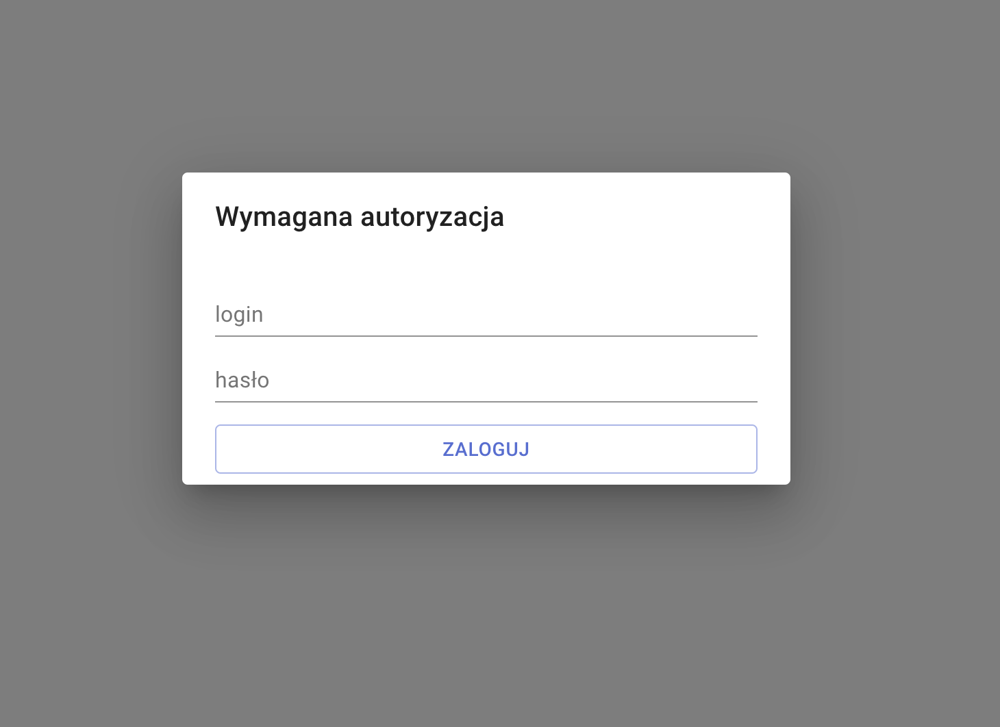
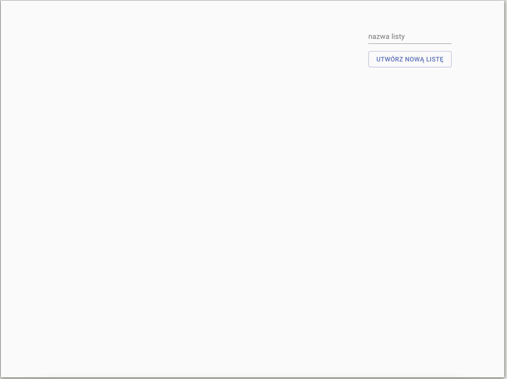
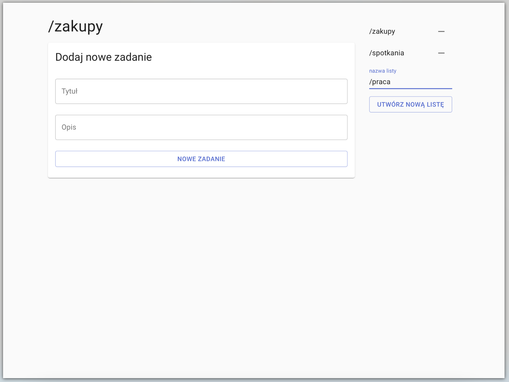
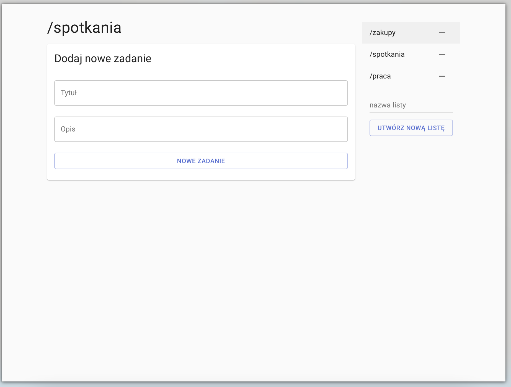
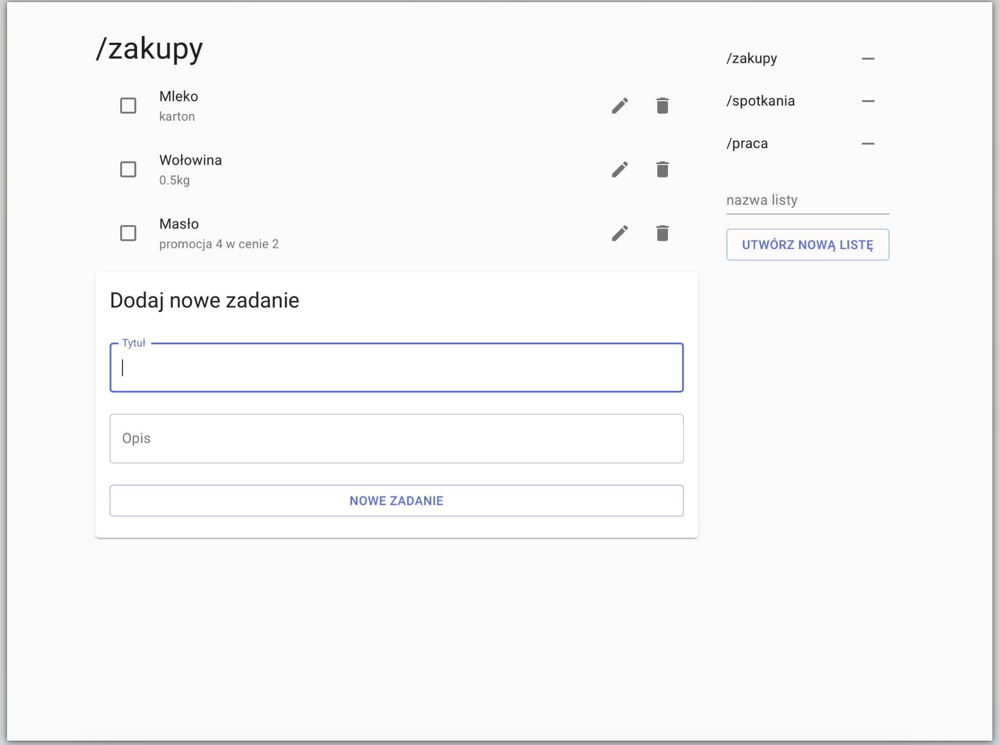
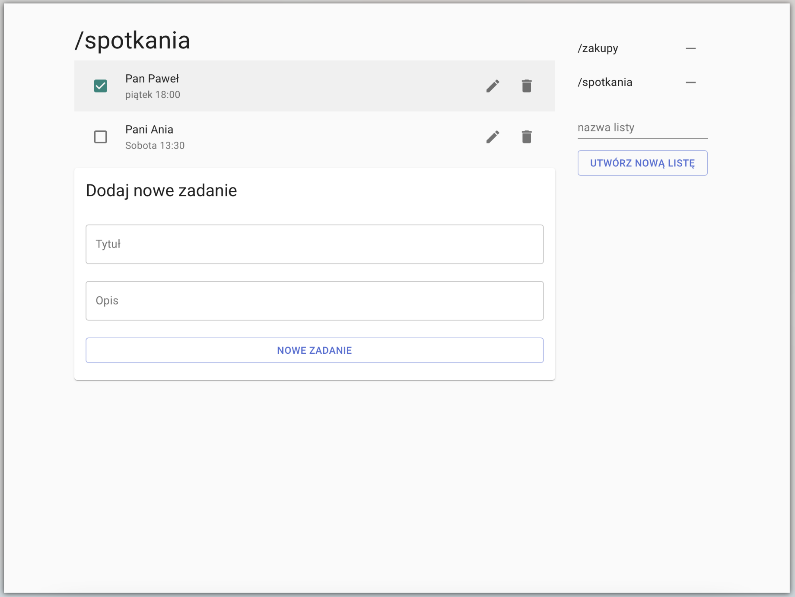

# aplikacja ToDo
## wymagania
Aplikacja korzysta z api, które przygotowałem na lab 4, zatem w tym repozytorium znajduje się jedynie frontend.
## sprawozdanie
Opisy zdjęć w tytułach (należy najechać kursorem)

, następnie aby zapisać zmiany należy kliknąć na dyskietkę. W celu odrzucenia zmian należy kliknąć na przycisk x")
, należy kliknąć w przycisk kosza")
